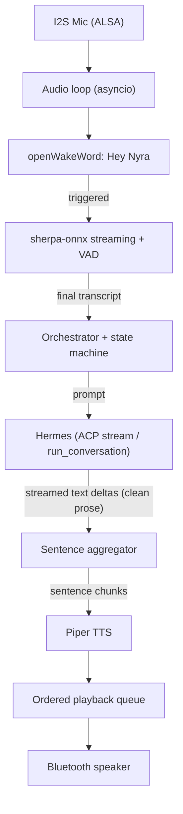
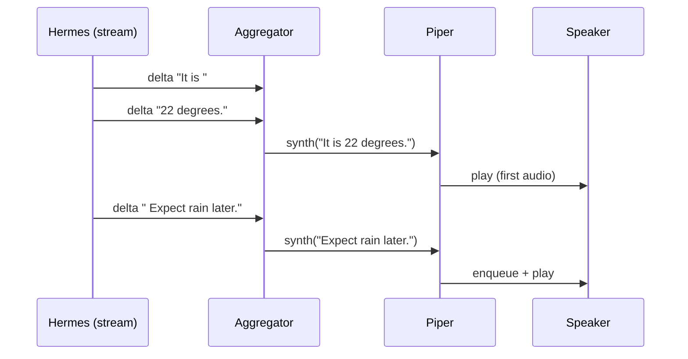

# Nyra - Product Requirements Document

Status: Draft v0.2
Owner: pi
Scope note: **v1 is voice-only.** The GUI (Chromium kiosk + SPA, dynamic cards) is explicitly deferred to a later phase. v1 streams clean prose from Hermes straight into TTS.
Target hardware: Raspberry Pi 5 (4GB), I2S mic, Bluetooth speaker. Housed in a 3D-printed desk case.

---

## 1. Summary

Nyra is a local, streaming, offline-first voice assistant that replaces Alexa for this device. It listens for a wake word entirely on-device, transcribes speech in real time, hands the request to the locally-installed Hermes agent, and speaks the streamed answer back.

The defining product property is **low perceived latency**: Nyra begins speaking as soon as Hermes starts streaming its response, rather than waiting for the full answer. This is achieved by consuming Hermes' streaming output and pipelining clean prose directly into incremental text-to-speech.

---

## 2. Goals and non-goals

### Goals (v1)
- Fully local wake-word detection ("Hey Nyra"), running continuously at low CPU.
- Real-time streaming speech-to-text with automatic end-of-utterance detection.
- Stream Hermes' response token-by-token and start TTS playback on the first complete clause/sentence ("instant" playback), feeding **clean prose directly into TTS**.
- Run as a resilient background service that starts on boot.

### Non-goals (v1, deferred to later phases)
- **The entire GUI** (Chromium kiosk, Vite SPA, dynamic cards, screen state visuals). Deferred to Phase 2.
- Any structured `{ui_type, data}` payload from Hermes — v1 consumes plain prose only.
- Multi-user voice identification / speaker diarization.
- Cloud-hosted control plane or remote management UI.
- Reusing Hermes' built-in faster-whisper voice mode (deliberately replaced by the lighter openWakeWord + sherpa-onnx + Piper stack).
- Wake-word-free always-on conversation.

---

## 3. Users and primary use cases

Single primary user: the device owner, interacting hands-free from across a desk/room. All v1 interactions are spoken-only (no screen).

1. "Hey Nyra, <question>" -> spoken streamed answer.
2. "What's the weather?" -> spoken answer.
3. Follow-up question -> spoken answer (conversation continuity per Hermes session behavior).
4. Wake word spoken while Nyra is talking -> barge-in: it stops and listens again.

---

## 4. Hardware and platform requirements

- Raspberry Pi 5, 4GB RAM, Raspberry Pi OS (64-bit).
- **I2S microphone** (note: I2S, not I2C). Currently `arecord -l` shows no capture device, so an I2S overlay must be enabled in `/boot/firmware/config.txt` and verified before any audio feature works. This is a hard prerequisite.
- **Bluetooth speaker** for output, paired/trusted, with Piper output routed to its ALSA/PulseAudio sink.
- Waveshare 3.5" 320x480 capacitive touchscreen is present but **unused in v1** (reserved for Phase 2 GUI).
- Hermes agent already installed at `~/.hermes/hermes-agent`, configured with an OpenAI-compatible model endpoint (inference is offloaded, so the Pi does not load multi-GB model weights).

---

## 5. Functional requirements

### 5.1 Wake word
- Detect "Hey Nyra" locally via openWakeWord (sub-100KB `.onnx`), <~0.5 core.
- On detection: transition state to `listening` and start STT.
- v1 may ship a stock/placeholder wake word and swap in a trained "Hey Nyra" model later.

### 5.2 Streaming STT
- Stream mic audio into sherpa-onnx `OnlineRecognizer` (streaming Zipformer, int8) for live partial transcripts.
- Use VAD endpointing to detect end-of-utterance; emit the final transcript and transition to `thinking`.

### 5.3 Hermes handoff (streaming, clean prose)
- Nyra consumes Hermes' **streaming** output, not a blocking one-shot result.
- As text deltas arrive, a sentence aggregator buffers them and flushes complete clauses/sentences **directly to TTS** so audio playback starts on the first sentence. No structured UI parsing in v1 — the stream is treated as plain prose.
- Integration boundary (decided during build, both are real and verified):
  - **Option A - ACP adapter subprocess (recommended default):** spawn `hermes acp` (`python -m acp_adapter.entry`) and speak ACP JSON-RPC; consume `session/update` notifications of type `agent_message_chunk` (`acp_adapter/server.py:982`) as the token stream. Clean process/venv isolation and a defined protocol contract.
  - **Option B - in-process callback (lowest latency):** call the agent's `run_conversation(prompt, stream_callback=fn)` where `fn(text_delta)` fires per chunk (the same hook used by `tui_gateway/server.py:8419` and `delegate_tool.py:1713`). Tightest latency but couples Nyra to Hermes' Python venv and an internal signature.
- Default to Option A for stability; keep Option B as a documented latency optimization.

### 5.4 Streaming TTS and playback
- Piper synthesizes each flushed sentence; an ordered playback queue plays chunks sequentially without overlap, routed to the Bluetooth speaker.
- First-audio target: begin speaking within a short, bounded delay after Hermes' first sentence completes.
- **Barge-in:** a wake word detected during `speaking` cancels current playback and returns to `listening`.

### 5.5 State machine
`idle -> listening -> thinking -> speaking -> idle`, tracked internally (drives STT start/stop, barge-in, and logging). `thinking` and `speaking` overlap during streaming (speech starts while more text streams in). No external broadcast in v1.

### 5.6 Services / lifecycle
- `nyra.service` (Python, asyncio) starts on boot and auto-restarts on failure. No kiosk in v1.

---

## 6. Architecture

### Streaming detail

---

## 7. Component breakdown (project root `/home/pi/nyra`)

- `orchestrator/` (Python, asyncio): `main.py` (wires the pipeline + service entry), `state.py`, `audio.py`, `wakeword.py`, `stt.py`, `tts.py` (sentence queue + Piper), `hermes_client.py` (streaming ACP/in-process consumer + sentence aggregator), `config.py`.
- `models/`: `wakeword/hey_nyra.onnx`, sherpa Zipformer (int8), Piper voice.
- `scripts/`: `setup.sh`, `nyra.service`.
- `pyproject.toml` / `requirements.txt`, `README.md`.
- (Phase 2, not in v1) `frontend/` Vite SPA + `nyra-kiosk.service`.

---

## 8. Latency targets (initial, to validate on-device)

- Wake word -> `listening`: < 300 ms.
- End-of-speech -> Hermes first delta: depends on configured model endpoint.
- Hermes first sentence -> first audio out: < 400 ms.
- Wake-word CPU budget: < 0.5 core sustained.

---

## 9. Milestones (v1)

1. Repo scaffold + service skeleton.
2. Hardware bring-up: I2S mic + Bluetooth speaker verified.
3. Wake word ("Hey Nyra").
4. Streaming STT + VAD.
5. Streaming Hermes client (ACP) + sentence aggregator.
6. Streaming Piper playback + ordered queue + barge-in.
7. Orchestrator wiring the state machine end-to-end.
8. systemd service + boot autostart.
9. End-to-end latency tuning.

(Phase 2: GUI — Vite SPA, Chromium kiosk, dynamic cards, WebSocket/UI channel.)

---

## 10. Risks and open questions

- **Hardware gate:** no capture device is currently present; the whole audio path is blocked until the I2S mic is configured and verified.
- **Internet dependence:** "offline-first" holds for wake/STT/TTS, but answer quality depends on Hermes' configured model endpoint; truly offline answers would require a local model and a different RAM budget.
- **ACP vs in-process coupling:** ACP is more stable but adds plumbing; in-process is faster but ties Nyra to Hermes internals and venv.
- **Sentence chunking quality:** aggressive flushing lowers latency but can produce choppy prosody; tune flush boundaries.
- **Keep Phase 2 cheap:** structure the state machine and Hermes client so a UI directive / tool-call channel can be added later without rework.
- Open: exact sherpa model + Piper voice; train "Hey Nyra" now vs. placeholder.

---

## 11. Success criteria (v1)

- Saying "Hey Nyra, <question>" reliably wakes, transcribes, and answers aloud with a sub-second perceived start.
- Runs unattended across reboots as a background service.
- Wake-word and idle CPU/RAM stay within budget.
