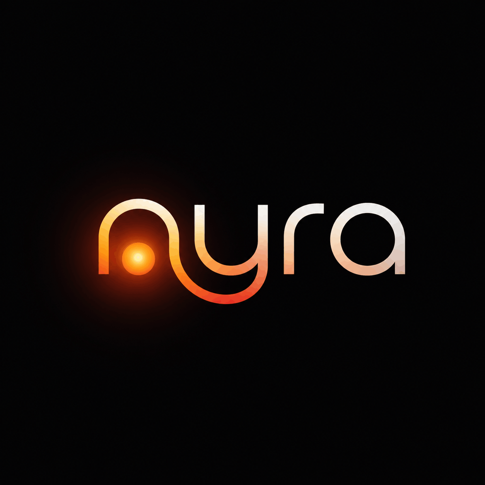

<!-- <h1 align="center">Nyra</h1> -->
<p align="center">
  
</p>

<p align="center">
  <strong>Nyra remembers you, learns from every conversation, and never goes silent while work happens in the background.</strong>
</p>

<p align="center">
  A voice assistant built on <a href="https://docs.cognee.ai">Cognee</a> memory and Hermes delegation — the kind of assistant smart speakers promised but never delivered.
</p>

<p align="center">
  Built for the Cognee hackathon · Voice-native memory on Raspberry Pi
</p>

<p align="center">
  <a href="https://youtu.be/CeosXxI2yZ4">
    
  </a>
  <br />
  <strong><a href="https://youtu.be/CeosXxI2yZ4">Watch the demo on YouTube</a></strong>
</p>

---

## TL;DR

**Nyra** is a voice assistant for Raspberry Pi, built with LiveKit Agents. It remembers you across sessions and stays conversational while work runs in the background.

**What makes it different**

- **Memory** — Cognee knowledge graph, not session amnesia
- **Speed** — `recall()` injects your facts before every reply
- **Learning** — `remember()` and `improve()` build permanent context
- **Privacy** — `forget()` prunes what you no longer want stored
- **Background work** — Hermes handles slow tasks while Nyra keeps talking

**Cognee lifecycle in one line:** ingest with `remember()` → query with `recall()` → enrich with `improve()` → prune with `forget()`.

## Beyond Alexa

Smart speakers answer in the moment. They forget you between sessions, stall on anything that takes longer than a few seconds, and treat every user the same. Nyra is different.

| Alexa-style assistants | Nyra |
|------------------------|------|
| Forgets you between sessions | **Cognee knowledge graph** persists preferences, facts, and context |
| Blocks on slow tasks | **Hermes** runs research, browsing, and file work asynchronously |
| Generic answers | **`recall()`** injects *your* data before every reply |
| No graph enrichment | **`improve()`** consolidates session learnings into permanent memory |
| Hard to erase data | **`forget()`** surgically prunes what you no longer want stored |

Alexa answers in the moment. Nyra **recalls** your history, **remembers** what matters, **improves** its graph after every session, **forgets** on request, and **delegates** work that would make any voice assistant go silent.


---


**Stack:** LiveKit Agents · Deepgram Nova-3 STT · OpenAI LLM/TTS · Silero VAD · multilingual turn detection · Cognee Cloud or local graph · Hermes gateway · Pygame status UI · openWakeWord standby on Raspberry Pi.

---


## Quick start

### Prerequisites

- Python 3.10+
- [UV](https://docs.astral.sh/uv/) package manager
- API keys: OpenAI, Deepgram
- Cognee Cloud tenant (recommended) or local Cognee install

### Install and configure

```bash
uv sync
cp .env.example .env
```


### Seed memory

```bash
uv run python ingest_cloud.py path/to/your/notes.md
```

Or set `COGNEE_BOOTSTRAP_PATH` in `.env` to auto-ingest on first startup when the cloud graph is empty.

### Run Nyra

```bash
uv run python nyra_agent.py console
```

Console mode uses your microphone and speakers — no LiveKit server required. A Pygame status window launches automatically (disable with `NYRA_UI_ENABLED=false`).

### Run tests

```bash
uv run pytest -v --asyncio-mode=auto
```

---

## Environment variables


### Cognee memory

| Variable | Description |
|----------|-------------|
| `COGNEE_BASE_URL` | Cognee Cloud tenant URL |
| `COGNEE_API_KEY` | Cognee Cloud API key |
| `SESSIONS_DATASET` | Target dataset name (default: `default_dataset`) |
| `COGNEE_RECALL_TYPE` | `CHUNKS`, `GRAPH_COMPLETION`, or `GRAPH_SUMMARY_COMPLETION` |
| `COGNEE_RECALL_TIMEOUT` | Recall timeout in seconds (default: `8.0` cloud) |
| `COGNEE_BOOTSTRAP_PATH` | Comma-separated files to ingest when graph is empty |
| `COGNEE_SYSTEM_ROOT_DIRECTORY` | Local Cognee storage (fallback when cloud vars unset) |

### Hermes (optional)

| Variable | Description |
|----------|-------------|
| `HERMES_API_URL` | Hermes gateway URL (default: `http://127.0.0.1:8642`) |
| `HERMES_API_KEY` | Hermes API server key |
| `HERMES_SESSION_KEY` | Session key prefix (default: `nyra`) |
| `HERMES_MAX_CONCURRENT` | Max parallel Hermes runs (default: `3`) |

Verify Hermes is running: `curl localhost:8642/health`

### UI and wake word (optional)

| Variable | Description |
|----------|-------------|
| `NYRA_UI_ENABLED` | Launch Pygame status window (default: `true`) |
| `NYRA_UI_FULLSCREEN` | Kiosk mode for Pi display |
| `NYRA_WAKEWORD_ENABLED` | Passive listening until wake word (default: `true`) |
| `NYRA_FILLER_DELAY_SECONDS` | Delay before filler speech during thinking |

See [`.env.example`](.env.example) for the full list.

---


